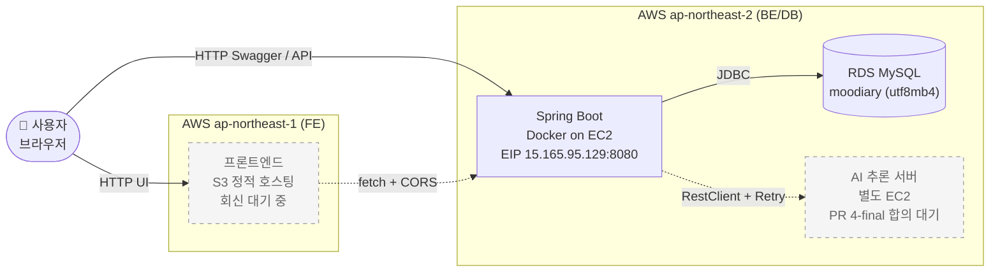
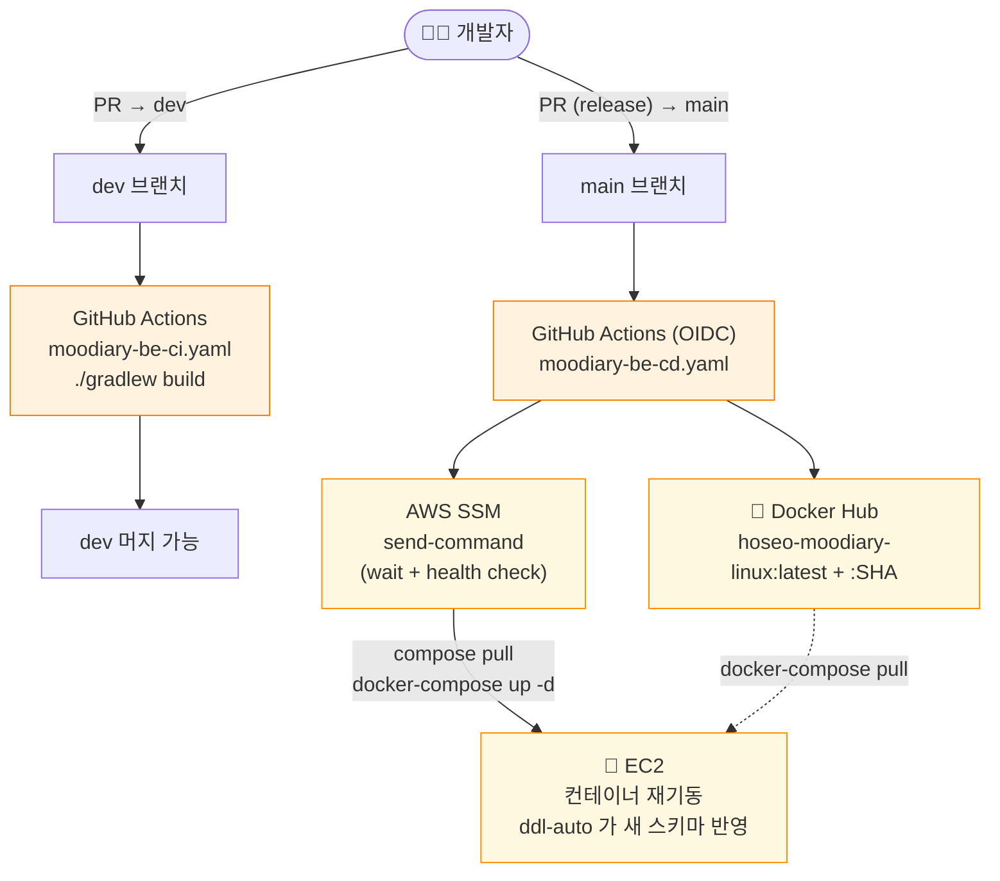

# Moodiary Backend

> 호서대학교 컴퓨터공학부 졸업 프로젝트 — 일기와 AI 감성 분석을 결합한 **무드 캘린더** 플랫폼의 백엔드 API.

[](https://spring.io/projects/spring-boot)
[](https://openjdk.org/projects/jdk/25/)
[](https://www.mysql.com/)
[](https://aws.amazon.com/)

🔗 **운영**: [`http://15.165.95.129:8080`](http://15.165.95.129:8080)
📖 **Swagger UI**: [`/swagger-ui/index.html`](http://15.165.95.129:8080/swagger-ui/index.html)
📜 **OpenAPI spec**: [`/v3/api-docs`](http://15.165.95.129:8080/v3/api-docs)

---

## 📚 문서 navigator

처음 본 사람은 위에서 아래로 — 이미 코드 작업 중이라면 상황에 맞게 점프.

| 너의 상황 | 보는 파일 |
|---|---|
| 무엇이 끝났고 무엇이 남았나 (PR 단위 로드맵) | [`claude-docs/plan.md`](./claude-docs/plan.md) |
| API 호출 규약 — 응답 포맷, 에러 매핑, 인증 헤더, CORS | [`claude-docs/api-contracts.md`](./claude-docs/api-contracts.md) |
| 보안 한눈에 — JWT / Refresh Token / CORS / 인가 흐름 | [`claude-docs/security.md`](./claude-docs/security.md) |
| **작업 중 막혔다** — 누가 같은 trap 을 먼저 만났을 수도 | [`claude-docs/troubleshooting.md`](./claude-docs/troubleshooting.md) |
| **기술 개념 모르겠다** — 발표 / 면접 / Q&A 대비 | [`claude-docs/learning-notes.md`](./claude-docs/learning-notes.md) |
| 코드 짜기 전 컨벤션 / PR 워크플로우 규칙 | [`CLAUDE.md`](./CLAUDE.md) |
| 운영/배포 셋업 절차 (EC2 치트시트, FE S3 배포 가이드 등) | [`claude-docs/ops-runbooks/`](./claude-docs/ops-runbooks/) |

---

## 🎯 무엇을 하는 프로젝트인가

사용자가 일기를 작성하면 AI 가 **공감 메시지 + 그 날의 기분 이모지**를 생성한다. 그 이모지는 월별 캘린더 화면에 매핑되어, 한 달 치 감정을 한눈에 보여준다.

```
일기 작성 → AI 분석 (글 + 😊) → 캘린더에 표시
```

### 본 레포의 역할

**백엔드 API 서버.** 다음을 담당:
- 회원가입 / JWT 로그인 / **Refresh Token (rotation)** / 인증
- 일기 CRUD (작성자 격리)
- AI 추론 비동기 응답 — `@Async` + DB 상태 머신 (`PENDING → DONE/FAILED`)
- 월별 캘린더 데이터 집계 (QueryDSL 기반)

### 다른 컴포넌트

| 컴포넌트 | 위치 | 역할 |
|---|---|---|
| Frontend | (별도 레포) | React + Vite SPA, S3 정적 호스팅 |
| AI 추론 서버 | (별도 레포) | 일기 텍스트 → 응답 + 이모지 생성, EC2 배포 (PR 4-final 합의 대기) |

---

## 🏗️ 기술 스택

| 분류 | 기술 |
|---|---|
| 언어/런타임 | Java 25 (Amazon Corretto) |
| 프레임워크 | Spring Boot 4.0.6, Spring Security 6, Spring Data JPA, QueryDSL 5 |
| 데이터 | MySQL 9.x (운영 RDS, `utf8mb4`), Hibernate 7.2 |
| 인증 | JWT (jjwt 0.12.6, **HS256**, access 1h) + **Refresh Token (2w, rotation, SHA-256 hash)** + BCrypt |
| 비동기 | `@EnableAsync` + Spring 기본 `ThreadPoolTaskExecutor` |
| API 문서 | SpringDoc OpenAPI 3.0.3 (Swagger UI) |
| 빌드 | Gradle 9, Java 25 toolchain |
| 운영 | Docker, AWS EC2 (Amazon Linux 2023) + RDS, Elastic IP |
| CI/CD | GitHub Actions (OIDC) → Docker Hub → AWS SSM `send-command` |

---

## 🏛️ 아키텍처

### 레이어

```
Controller (HTTP, @AuthenticationPrincipal UUID)
    ↓
Service (@Transactional 비즈니스 로직 + 소유권 검증)
    ↓
Repository (Spring Data JPA + QueryDSL)
    ↓
Entity (BaseEntity 상속 → createdAt/updatedAt 자동, UUID PK)
```

### 패키지

```
hoseo.moodiary
├── controller/     # @RestController — HTTP 엔드포인트
├── service/        # 비즈니스 로직 + 소유권 검증
│   └── ai/         # AI 어댑터 (Stub / Real 분리, PR 4-final 시 interface 추출)
├── repository/     # Spring Data JPA + QueryDSL
├── entitiy/        # JPA 엔티티 (※ "entitiy" 오타 — 의도적 유지)
│   └── base/       # BaseEntity — JPA Auditing (createdAt/updatedAt)
├── dto/
│   ├── request/    # 입력 DTO + Bean Validation
│   └── response/   # 출력 DTO (@JsonInclude(NON_NULL) 정책)
├── exception/      # 도메인 예외 + GlobalExceptionHandler
├── security/       # JwtTokenProvider, JwtAuthenticationFilter
└── config/         # SecurityConfig, CorsConfig, AsyncConfig, JpaAuditingConfig, QuerydslConfig
```

### 인증 흐름 (런타임)

```
1. 클라이언트 → POST /auth/login
2. UserService — BCrypt.matches() → JwtTokenProvider.createAccessToken(userId)
                                  → RefreshTokenService.issue(userId) (SHA-256 hex 저장)
3. 응답 { accessToken (1h), refreshToken (2w), userId }
4. 클라이언트 — Authorization: Bearer <accessToken>
5. JwtAuthenticationFilter — 토큰 검증 → SecurityContext UUID principal 주입
6. 컨트롤러 — @AuthenticationPrincipal UUID userId 자동 주입

[access 만료 시]
7. 클라이언트 → POST /auth/refresh { refreshToken }
8. RefreshTokenService.rotate — 기존 토큰 revoke + 새 토큰 발급
9. 응답 { accessToken (새), refreshToken (새) }  ← 기존 refresh 는 즉시 무효화

[로그아웃]
10. 클라이언트 → POST /auth/logout { refreshToken }
11. RefreshTokenService.revoke (idempotent) + FE 가 localStorage 클리어
```

### 비동기 AI 응답 흐름 (PR 4-pre 운영 반영)

```
1. POST /post → PostService.create()
   ├─ Post 저장
   └─ AiResponse(status=PENDING) 같은 트랜잭션에 저장 (정합성 보장)
2. PostController 가 commit 후 AiResponseService.triggerAsync(postId) 호출 (race free)
3. @Async 스레드:
   ├─ AiResponseClient.invoke(...) — 현재 Stub (PR 4-final 시 HTTP 어댑터로 교체)
   ├─ 성공 → PENDING → DONE + content + emoji
   └─ AiInferenceException → PENDING → FAILED + errorMessage
4. 클라이언트는 GET /post/{id}/ai-response 로 폴링 (소유권 검증)
   응답: status 별 다른 필드 (@JsonInclude(NON_NULL) — errorMessage 는 FAILED 에만)
```

---

## 🗄️ 데이터베이스

### ER 다이어그램

```mermaid
erDiagram
    User ||--o{ Post : "writes"
    User ||--o{ RefreshToken : "has"
    Post ||--|| AiResponse : "1:1 (UNIQUE post_id)"

    User {
        UUID user_id PK
        string user_email UK
        string user_password "BCrypt hash"
        string user_nickname UK
        datetime created_at
        datetime updated_at
    }
    Post {
        UUID post_id PK
        UUID user_id FK
        string post_title
        text post_content
        datetime created_at
        datetime updated_at
    }
    AiResponse {
        UUID ai_response_id PK
        UUID post_id FK_UK "uk_ai_response_post_id"
        enum ai_response_status "PENDING|DONE|FAILED"
        text ai_response_content
        string ai_response_emoji
        string ai_response_error_message
        datetime created_at
        datetime updated_at
    }
    RefreshToken {
        UUID refresh_token_id PK
        UUID user_id "idx_refresh_token_user_id"
        string refresh_token_hash UK "SHA-256 hex 64자"
        datetime expires_at
        datetime revoked_at "null=유효"
        datetime created_at
        datetime updated_at
    }
```

### 핵심 정책

| 정책 | 내용 |
|---|---|
| **PK** | UUID v4 (`@UuidGenerator`). 컬럼명 = `<table>_id` (예: `post_id`). 분산 환경 가정 + ID 추측 방지 |
| **Auditing** | 모든 엔티티가 `BaseEntity` 상속 → `created_at` / `updated_at` 자동. `@EnableJpaAuditing` 은 `JpaAuditingConfig` 에 분리 (슬라이스 테스트 호환) |
| **Charset** | `utf8mb4` — 이모지 (`😊`) 를 그대로 저장. 변환 로직 X |
| **불변 + 명시 메서드** | 엔티티 setter 없음. `@NoArgsConstructor(PROTECTED)` + 명시 메서드 (예: `Post.update(...)`, `AiResponse.markDone(...)`) → `@Transactional` dirty-checking 으로 UPDATE |
| **`ddl-auto: update`** | 스키마 미확정 단계 정책. 부팅 시 누락 컬럼/테이블 자동 추가 (기존 데이터 보존). **인덱스 / UNIQUE 제약은 보장 X** → 운영 머지 후 수동 확인 권장 |
| **1:1 관계** | `Post` ↔ `AiResponse` 는 `@Table(uniqueConstraints)` 명시 + 운영 적용 후 `SHOW INDEX` 사후 검증 |
| **Flyway 도입 예정** | PR 6 시점에 `validate` 로 전환. 그 전까지는 ddl-auto 함부로 변경 X |

> 운영 RDS 의 정확한 스키마는 [`ops-runbooks/ec2-cheatsheet.md`](./claude-docs/ops-runbooks/ec2-cheatsheet.md) 의 `SHOW CREATE TABLE` 명령으로 확인.

---

## 🚢 인프라 / 배포

### 운영 아키텍처 (Runtime)



### CI/CD 파이프라인

**dev 머지 = CI 만**, **main 머지 = CD 가 자동 배포**.



### 인프라 요약

| 환경 | 위치 | 비고 |
|---|---|---|
| 애플리케이션 | AWS EC2 + Docker (Amazon Linux 2023) | Elastic IP `15.165.95.129` (인스턴스 stop/start 무관) |
| DB | AWS RDS MySQL 9.x | `utf8mb4` 강제. 자격증명은 GitHub Secrets + EC2 `.env` 이중 |
| 이미지 | Docker Hub (`<owner>/hoseo-moodiary-linux:latest` + `:<SHA>`) | SHA 태그로 롤백 가능 |
| 배포 자동화 | GitHub Actions (OIDC) → AWS SSM `send-command` | SSH 키 관리 불필요. 명령은 `docker-compose` (하이픈, [T-023](./claude-docs/troubleshooting.md#t-023)) |
| 컨테이너 자동 기동 | `compose.yaml` `restart: unless-stopped` + `pull_policy: always` | EC2 재부팅 시 자동 복구 |
| CD 안전망 | SSM `wait command-executed` + health check (`/v3/api-docs`) | [T-019](./claude-docs/troubleshooting.md#t-019) 의 silent fail 차단 |

### 운영 환경변수 (컨테이너 주입)

| 키 | 용도 | 기본값 |
|---|---|---|
| `SPRING_DATASOURCE_URL` / `_USERNAME` / `_PASSWORD` | RDS | 로컬은 `localhost:3309` / `dev` / `dev123` |
| `JWT_SECRET` | JWT 서명 키 (HS256, **Base64 32바이트 이상**) | dev 전용 placeholder |
| `JWT_ACCESS_EXPIRATION_MS` | Access token 수명 | `3600000` (1h) |
| `JWT_REFRESH_EXPIRATION_MS` | Refresh token 수명 | `1209600000` (2w) |
| `APP_CORS_ALLOWED_ORIGINS` | CORS 허용 origin (콤마 구분) | `localhost:3000,localhost:5173` |
| `SPRING_JPA_HIBERNATE_DDL_AUTO` | Hibernate DDL 모드 | `update` (Flyway 도입 시 `validate`) |

> ⚠️ **운영 머지 전 필수 체크리스트** — `application.yaml` / `compose.yaml` / DB 스키마 / `.github/workflows/` 등 운영 영향 변경 시 PR body 에 "운영 머지 전 필수" 체크리스트 박는다 ([CLAUDE.md](./CLAUDE.md) 워크플로우 룰).

---

## 🔐 보안

### 인증

| 항목 | 정책 |
|---|---|
| 비밀번호 | BCrypt (strength 기본 10). 평문은 어디에도 남기지 않음 |
| Access Token | JWT (HS256, jjwt 0.12.6). 1시간 수명. Claims: `sub=UUID`, `iat`, `exp` |
| Refresh Token | 32-byte secure random (URL-safe base64). 2주 수명. **DB 에 SHA-256 hex 만 저장** — raw token 노출 시에도 DB 만으론 복원 불가 |
| **Refresh Rotation** | `POST /auth/refresh` 시 기존 토큰 즉시 revoke + 새 토큰 발급. 탈취된 refresh 가 한 번만 유효 |
| 로그아웃 | `POST /auth/logout` 으로 refresh 무효화. Access 는 stateless 라 만료 대기 (1시간). FE 는 localStorage 즉시 클리어 |

### 인가

- `@AuthenticationPrincipal UUID userId` 패턴 — 컨트롤러가 현재 사용자 UUID 를 자동으로 받는다
- 도메인 소유권 검증 — `Post.isOwnedBy(userId)` / 서비스 레이어에서 `PostAccessDeniedException` 분기
- 화이트리스트 (`SecurityConfig.WHITELIST`) 외 모든 요청은 `authenticated()`. 미인증 시 `401 { "message": "인증이 필요합니다." }`

### CORS

- 명시적 origin allowlist (`app.cors.allowed-origins`, 콤마 구분). 와일드카드 `*` 금지 (`allowCredentials=true` 와 충돌)
- `compose.yaml` 의 `${VAR:-default}` 패턴으로 EC2 `.env` 누락 시에도 dev origins 으로 안전 동작
- preflight (OPTIONS) 는 인증 검사 없이 통과 — Spring Security 필터 체인 앞쪽에서 처리

### 시크릿 관리

| 시크릿 | 저장 위치 | 비고 |
|---|---|---|
| `JWT_SECRET` | GitHub Secrets + EC2 `.env` 이중 | 향후 AWS Parameter Store 단일화 검토 |
| RDS 자격증명 | GitHub Secrets + EC2 `.env` 이중 | 동일 |
| `application.yaml` | git 추적 ✅ | 값은 모두 `${ENV_VAR:기본값}` 플레이스홀더. 평문 비밀값 금지 ([T-013](./claude-docs/troubleshooting.md#t-013) 사고 이후 정책) |

### 정보 노출 최소화

- **열거 공격 방지** — `/auth/login` 401 메시지가 "이메일 미존재" / "비번 틀림" 을 구분하지 않음
- **Refresh 검증 실패 통일** — 존재 X / 만료 / revoke 모두 같은 401 메시지
- **`@JsonInclude(NON_NULL)`** — DONE 응답에 `errorMessage` 필드가 아예 직렬화 안 됨

📚 **보안 상세 + 약점 정리** → [`claude-docs/security.md`](./claude-docs/security.md)

---

## 📚 더 읽을 거리

| 문서 | 내용 |
|---|---|
| [`CLAUDE.md`](./CLAUDE.md) | Claude Code 작업 가이드 (워크플로우 규칙 + DB 정책 + 운영 룰) |
| [`claude-docs/plan.md`](./claude-docs/plan.md) | 로드맵 + 백로그 + 의사결정 로그 |
| [`claude-docs/api-contracts.md`](./claude-docs/api-contracts.md) | API 상세 명세 + 외부 AI 서버 계약 |
| [`claude-docs/security.md`](./claude-docs/security.md) | JWT / Refresh / 비밀번호 / 시크릿 / 인가 / 약점 정리 |
| [`claude-docs/troubleshooting.md`](./claude-docs/troubleshooting.md) | 누적 트러블슈팅 로그 (T-### 인덱스 grep) |
| [`claude-docs/learning-notes.md`](./claude-docs/learning-notes.md) | 모르고 물어봐서 배운 기술 개념 정리 (발표 / Q&A 대비) |
| [`claude-docs/ops-runbooks/`](./claude-docs/ops-runbooks/) | EC2 치트시트 / RDS 클린업 / FE S3 셋업 가이드 |

---

## 👥 팀

3인 졸업 프로젝트 — 호서대학교 컴퓨터공학부.
- Backend (이 레포)
- Frontend (별도 레포)
- AI 추론 서버 (별도 레포)

---

## 📝 라이선스

졸업 프로젝트 결과물. 별도 라이선스 명시 전까지 무단 사용/배포는 자제 부탁드립니다.
