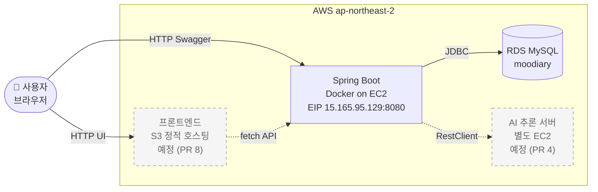
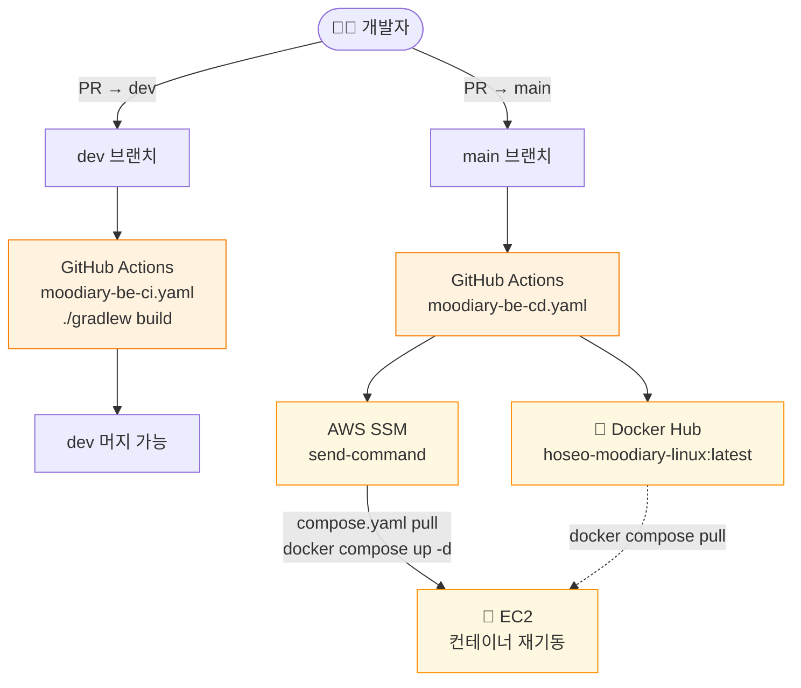

# Moodiary Backend

> 호서대학교 컴퓨터공학부 졸업 프로젝트 — 일기와 AI 감성 분석을 결합한 **무드 캘린더** 플랫폼의 백엔드 API.

[](https://spring.io/projects/spring-boot)
[](https://openjdk.org/projects/jdk/25/)
[](https://www.mysql.com/)
[](https://aws.amazon.com/)

🔗 **운영**: [`http://15.165.95.129:8080`](http://15.165.95.129:8080)
📖 **Swagger UI**: [`/swagger-ui/index.html`](http://15.165.95.129:8080/swagger-ui/index.html)
📜 **OpenAPI spec**: [`/v3/api-docs`](http://15.165.95.129:8080/v3/api-docs)

---

## 📚 문서 navigator

처음 본 사람은 위에서 아래로 — 이미 코드 작업 중이라면 상황에 맞게 점프.

| 너의 상황 | 보는 파일 |
|---|---|
| 무엇이 끝났고 무엇이 남았나 (PR 단위 로드맵) | [`claude-docs/plan.md`](./claude-docs/plan.md) |
| API 호출 규약 — 응답 포맷, 에러 매핑, 인증 헤더, CORS | [`claude-docs/api-contracts.md`](./claude-docs/api-contracts.md) |
| 보안 한눈에 — JWT 발급/검증, CORS, 인증/인가 흐름 | [`claude-docs/security.md`](./claude-docs/security.md) |
| **작업 중 막혔다** — 누가 같은 trap 을 먼저 만났을 수도 | [`claude-docs/troubleshooting.md`](./claude-docs/troubleshooting.md) — T-### 인덱스에서 grep |
| 코드 짜기 전 컨벤션 / PR 워크플로우 규칙 | [`CLAUDE.md`](./CLAUDE.md) |
| 운영 일회성 절차 (RDS 데이터 클린업 등) | [`claude-docs/ops-runbooks/`](./claude-docs/ops-runbooks/) |

---

## 🎯 무엇을 하는 프로젝트인가

사용자가 일기를 작성하면 AI 가 **공감 메시지 + 그 날의 기분 이모지**를 생성한다. 그 이모지는 월별 캘린더 화면에 매핑되어, 한 달 치 감정을 한눈에 보여준다.

```
일기 작성 → AI 분석 (글 + 😊) → 캘린더에 표시
```

### 본 레포의 역할
**백엔드 API 서버.** 다음을 담당:
- 회원가입 / JWT 로그인 / 인증
- 일기 CRUD (작성자 격리)
- AI 추론 서버 호출 + 비동기 응답 관리 *(예정, PR #4)*
- 월별 캘린더 데이터 집계 *(예정, PR #5)*

### 다른 컴포넌트
| 컴포넌트 | 위치 | 역할 |
|---|---|---|
| Frontend | (별도 레포) | React 기반 SPA, S3 호스팅 예정 |
| AI 추론 서버 | (별도 레포) | 일기 텍스트 → 응답 + 이모지 생성, EC2 배포 |

---

## 🏗️ 기술 스택

| 분류 | 기술 |
|---|---|
| 언어/런타임 | Java 25 (Amazon Corretto) |
| 프레임워크 | Spring Boot 4.0.6, Spring Security 6, Spring Data JPA |
| 데이터 | MySQL 9.x (운영 RDS), Hibernate 7.2 |
| 인증 | JWT (jjwt 0.12.6, HS512, 24h) + BCrypt |
| API 문서 | SpringDoc OpenAPI 2.8 (Swagger UI) |
| 빌드 | Gradle 9, Java 25 toolchain |
| 운영 | Docker, AWS EC2 (Amazon Linux 2023) + RDS, Elastic IP |
| CI/CD | GitHub Actions → Docker Hub → AWS SSM `send-command` |

---

## 🚀 빠른 시작 (로컬 개발)

### 사전 요구사항
- JDK 25 (Amazon Corretto 권장)
- Docker (MySQL 컨테이너 띄우기 용)

### 1) MySQL 컨테이너 띄우기
```bash
docker run -d --name moodiary-mysql -p 3309:3306 \
  -e MYSQL_ROOT_PASSWORD=root -e MYSQL_DATABASE=moodiary \
  -e MYSQL_USER=dev -e MYSQL_PASSWORD=dev123 mysql:8
```

### 2) (선택) 개인 설정 오버라이드
기본값(`localhost:3309`, `dev`/`dev123`)으로 충분하면 건너뛰어도 됨. 다른 DB를 쓰고 싶으면 `src/main/resources/application-local.yaml` 만들기:

```yaml
spring:
  datasource:
    url: jdbc:mysql://localhost:3306/mydb
    username: my_user
    password: my_pass
```

> ⚠️ `application.yaml` 은 직접 편집 X — 깃에 추적되며 모든 값은 `${ENV_VAR:default}` 플레이스홀더로 쓴다. 개인 설정은 `application-local.yaml`(gitignored) 에 한정.

### 3) 빌드 + 실행
```bash
# 빌드 (테스트 포함)
./gradlew build

# 단일 테스트 클래스
./gradlew test --tests "hoseo.moodiary.controller.PostControllerTest"

# 로컬 실행
./gradlew bootRun
```

부팅되면:
- API: http://localhost:8080
- Swagger UI: http://localhost:8080/swagger-ui/index.html

---

## 📡 API 한눈에

| 분류 | 메서드 | 경로 | 인증 |
|---|---|---|---|
| 인증 | POST | `/auth/signup` | ❌ |
| 인증 | POST | `/auth/login` | ❌ |
| Post | POST | `/post` | ✅ |
| Post | GET | `/post` | ✅ (본인 글만) |
| Post | GET | `/post/{id}` | ✅ (본인 글만) |
| Post | PUT | `/post/{id}` | ✅ (본인 글만) |
| Post | DELETE | `/post/{id}` | ✅ (본인 글만) |

### 표준 응답
- 정상: 도메인 DTO (Post 의 경우 `{id, title, content}`)
- 에러: **모든 에러가 동일 포맷**
  ```json
  { "message": "사람이 읽을 수 있는 메시지" }
  ```

### 응답 코드 매핑
| 코드 | 언제 |
|---|---|
| 200 | 정상 |
| 201 | 생성됨 (Post, signup) |
| 204 | 삭제됨 |
| 400 | Bean Validation 실패 (이메일 형식 / 비번 규칙 등) |
| 401 | 토큰 누락/만료/위조, 또는 로그인 자격 증명 불일치 |
| 403 | 인증은 됐지만 권한 없음 (타인 글 접근) |
| 404 | 리소스 없음 |
| 409 | 이메일/닉네임 중복 |

자세한 요청/응답 예시 → [`claude-docs/api-contracts.md`](./claude-docs/api-contracts.md)

### 인증 흐름
```bash
# 1) 회원가입
curl -X POST http://15.165.95.129:8080/auth/signup \
  -H "Content-Type: application/json" \
  -d '{"email":"u@example.com","password":"password123","nickname":"me"}'

# 2) 로그인 → 토큰 받기
TOKEN=$(curl -s -X POST http://15.165.95.129:8080/auth/login \
  -H "Content-Type: application/json" \
  -d '{"email":"u@example.com","password":"password123"}' | jq -r '.accessToken')

# 3) 이후 모든 요청에 Bearer 첨부
curl http://15.165.95.129:8080/post \
  -H "Authorization: Bearer $TOKEN"
```

---

## 🏛️ 아키텍처

### 레이어
```
Controller (HTTP)
    ↓
Service (@Transactional 비즈니스 로직)
    ↓
Repository (Spring Data JPA)
    ↓
Entity (BaseEntity 상속 → createdAt/updatedAt 자동)
```

### 패키지
```
hoseo.moodiary
├── controller/     # @RestController — HTTP 엔드포인트
├── service/        # 비즈니스 로직
├── repository/     # Spring Data JPA 인터페이스
├── entitiy/        # JPA 엔티티 (※ "entitiy" 오타이지만 유지)
│   └── base/       # BaseEntity — JPA Auditing
├── dto/
│   ├── request/    # 입력 DTO + Bean Validation
│   └── response/   # 출력 DTO
├── exception/      # 도메인 예외 + GlobalExceptionHandler
├── security/       # JWT 발급/검증
└── config/         # SecurityConfig, JpaAuditingConfig 등
```

### 인증 흐름 (런타임)
```
1. 클라이언트 → POST /auth/login
2. UserService — BCrypt.matches(), 성공 시 JwtTokenProvider.createAccessToken(userId)
3. 응답 { accessToken, userId }
4. 클라이언트 — Authorization: Bearer <token>
5. JwtAuthenticationFilter — 토큰 검증 → SecurityContextHolder 에 UUID principal 주입
6. 컨트롤러 — @AuthenticationPrincipal UUID userId 자동 주입
```

---

## 🚢 배포

### 운영 아키텍처 (Runtime)

사용자 요청이 어떻게 흐르는지. 점선/회색은 **예정** (PR 4 AI, PR 8 프론트).



### CI/CD 파이프라인

GitHub push → 빌드 → 배포까지. **dev 머지 = CI 만**, **main 머지 = CD 가 자동 배포**.



### 운영 인프라 요약
| 환경 | 위치 | 비고 |
|---|---|---|
| 애플리케이션 | AWS EC2 + Docker (Amazon Linux 2023) | Elastic IP `15.165.95.129` |
| DB | AWS RDS MySQL | 자격증명은 GitHub Secrets + EC2 `.env` 이중 관리 |
| 이미지 | Docker Hub (`<owner>/hoseo-moodiary-linux:latest`) | CD 가 push, SSM 이 pull |
| 배포 자동화 | GitHub Actions (OIDC) → AWS SSM `send-command` | SSH 키 관리 불필요 |
| 컨테이너 자동 기동 | `compose.yaml` 의 `restart: unless-stopped` + `pull_policy: always` | EC2 재부팅 시 자동 복구 |

### CI / CD 트리거
| 트리거 | 워크플로우 | 동작 |
|---|---|---|
| `PR → dev` | `moodiary-be-ci.yaml` | `./gradlew build` → 테스트 리포트 artifact 업로드 |
| `push → main` | `moodiary-be-cd.yaml` | 빌드 → Docker Hub push → AWS SSM 으로 EC2 에 `docker compose pull/up -d` |

### 운영 환경변수 (컨테이너 주입)
- `SPRING_DATASOURCE_URL` / `_USERNAME` / `_PASSWORD` — RDS
- `JWT_SECRET` — JWT 서명 키 (Base64 32바이트 이상)
- (옵션) `JWT_EXPIRATION_MS` / `SPRING_JPA_HIBERNATE_DDL_AUTO`

운영 이미지를 로컬에서 재현:
```bash
./gradlew build -x test
docker build -t moodiary:local .
```

---

## 📚 더 읽을 거리

| 문서 | 내용 |
|---|---|
| [`CLAUDE.md`](./CLAUDE.md) | Claude Code 작업 가이드 (워크플로우 규칙 포함) |
| [`claude-docs/plan.md`](./claude-docs/plan.md) | 로드맵 + 백로그 + 의사결정 로그 |
| [`claude-docs/api-contracts.md`](./claude-docs/api-contracts.md) | API 상세 명세 + 외부 AI 서버 계약 |
| [`claude-docs/security.md`](./claude-docs/security.md) | JWT / 비밀번호 / 시크릿 관리 / 인가 규칙 / 약점 정리 |
| [`claude-docs/troubleshooting.md`](./claude-docs/troubleshooting.md) | 누적 트러블슈팅 로그 |

---

## 👥 팀

3인 졸업 프로젝트 — 호서대학교 컴퓨터공학부.
- Backend (이 레포)
- Frontend (별도 레포)
- AI 추론 서버 (별도 레포)

---

## 📝 라이선스

졸업 프로젝트 결과물. 별도 라이선스 명시 전까지 무단 사용/배포는 자제 부탁드립니다.
